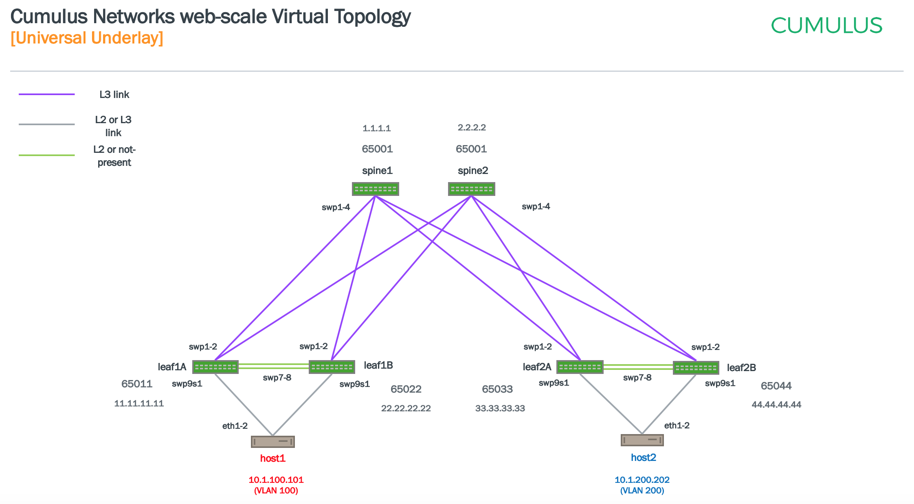
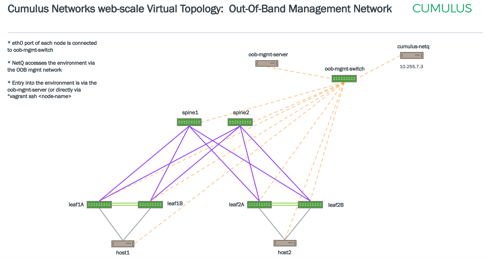

# Cumulus VX and NetQ 2.x Demo

Vagrant automates the creation of the devices (switches & servers) and their connectivity into VirtualBox or KVM.
Utilizes Ansible to configure a MLAG, BGP, VXLAN & EVPN environment.
Control-plane and data-plane validation & verification can be performed within this setup.  
  
  

  
  
  

